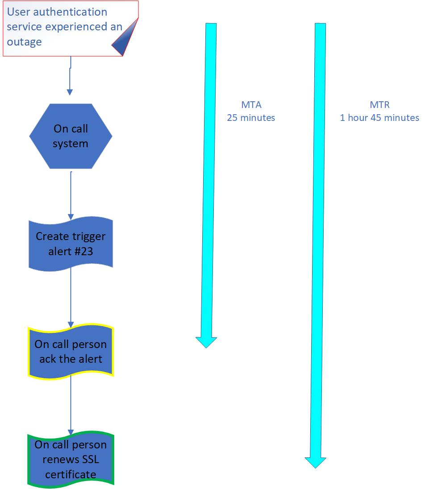

**Outage Postmortem - Web Stack Debugging Project**

**Issue Summary:**
- **Duration:** August 15, 2023, 14:30 UTC to August 15, 2023, 16:45 UTC
- **Impact:** The user authentication service experienced an outage, affecting all users attempting to log in. Approximately 60% of users were unable to access the system.
- **Root Cause:** An expired SSL certificate caused the authentication service to become inaccessible.

**Sequence Diagram:**

**Timeline:**
- **Detected:** August 15, 2023, 14:30 UTC
- **Detection Method:** Monitoring alert triggered due to high rate of failed authentication attempts.
- **Actions Taken:** Investigation started by checking server logs, analyzing network traffic, and verifying the SSL certificate status.
- **Misleading Paths:** Initial suspicion on a DDoS attack due to high failed attempts, but ruled out due to consistent pattern. Also, suspected database overload, but database logs indicated normal activity.
- **Escalated To:** Incident was escalated to the DevOps team for immediate response.
- **Resolution:** Expired SSL certificate was identified as the root cause. The service was brought back online by renewing the certificate and restarting the service.

**Root Cause and Resolution:**
- **Cause:** An SSL certificate used for secure communication had expired, causing the authentication service to terminate incoming connections.
- **Resolution:** The expired SSL certificate was replaced with a valid one, and the authentication service was restarted. All users were then able to log in without any issues.

**Corrective and Preventative Measures:**
- **Improvements:** 
  - **Automated Certificate Renewal:** Implement an automated process to monitor and renew SSL certificates before expiration.
  - **Monitoring Enhancement:** Improve monitoring to provide early alerts on impending certificate expirations.
- **Tasks to Address the Issue:**
  1. Implement a cron job for certificate renewal two weeks before expiration.
  2. Set up a centralized monitoring system to check and notify about certificate expiration dates.
  3. Conduct a review of other critical certificates to prevent similar incidents.
  4. Update incident response documentation to include SSL certificate expiration scenarios.

In summary, the outage was caused by an expired SSL certificate for the user authentication service. The incident was detected through monitoring alerts and promptly escalated to the DevOps team. The team identified the root cause and resolved the issue by renewing the certificate and restarting the service. To prevent future occurrences, the team will implement automated certificate renewal and enhance monitoring practices to ensure timely identification of expiring certificates.